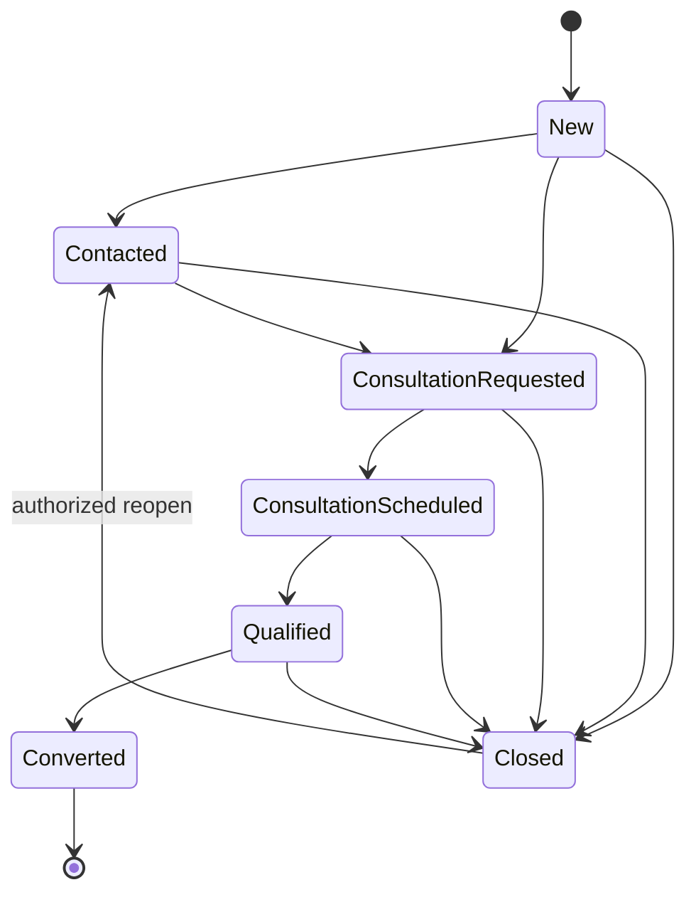
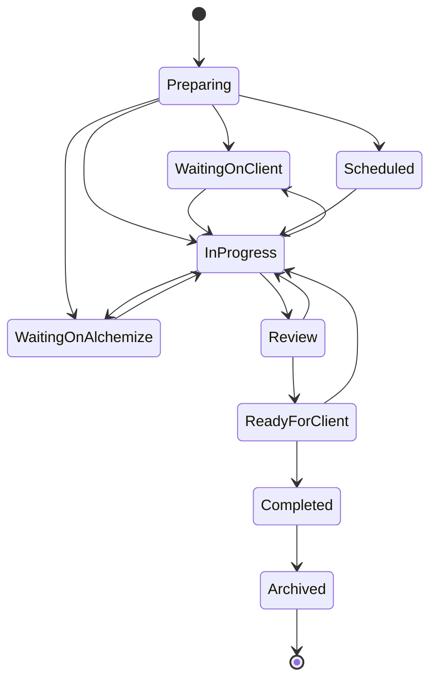
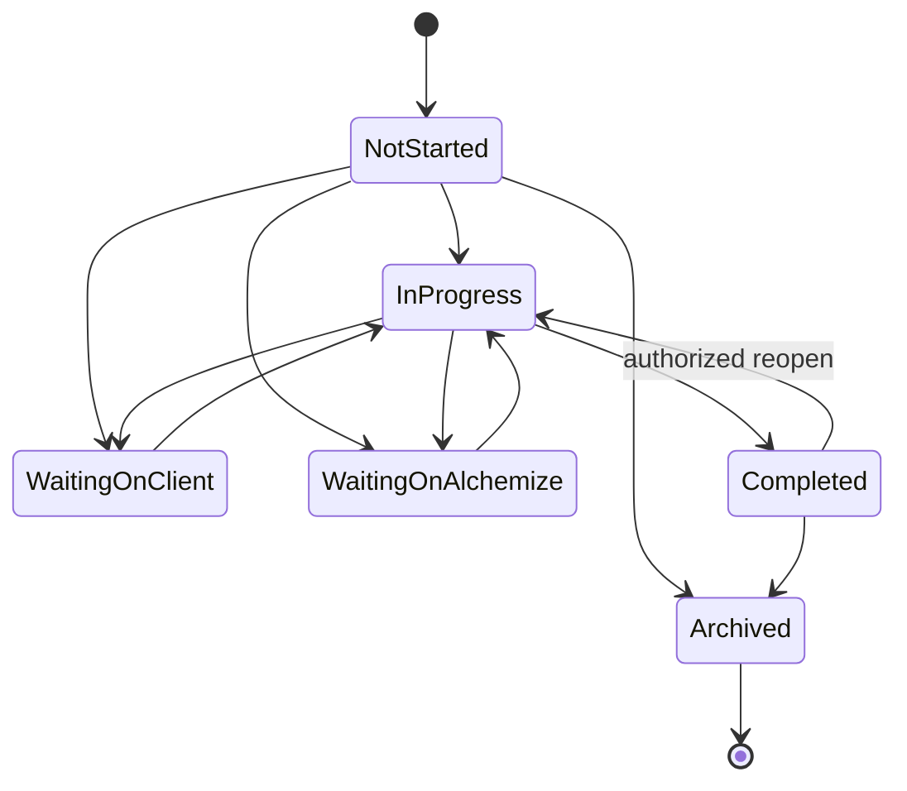
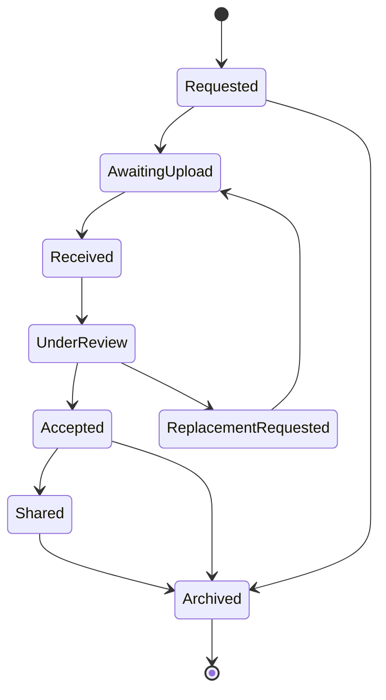
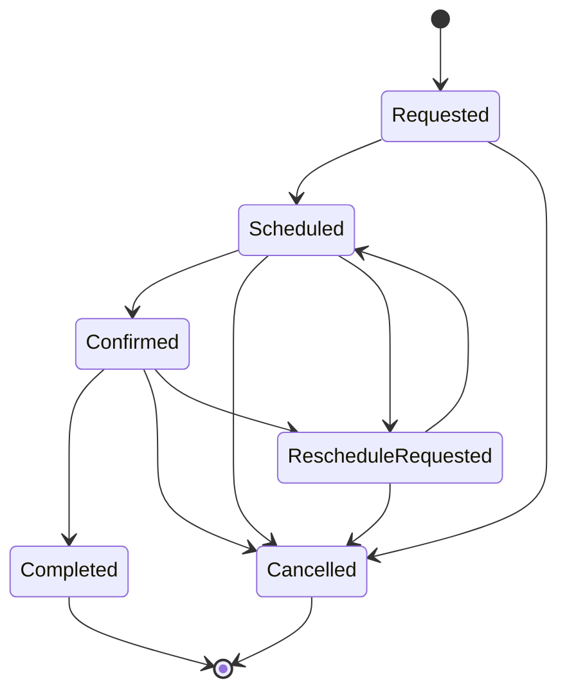
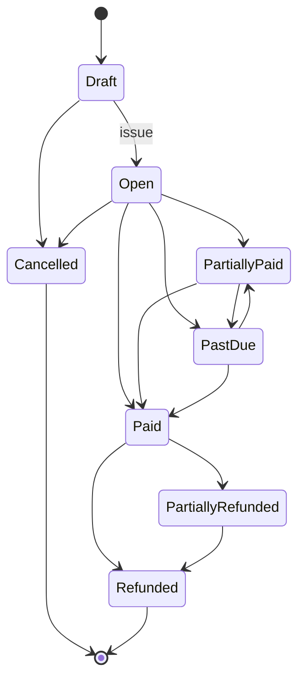

# Alchemize State Machines

State changes require server-side authorization, validation, an ActivityEvent when operationally meaningful, and an AuditEvent when security/financially significant. Invalid transitions return a conflict error; clients may not set arbitrary status strings.

## Lead

Converted is terminal. Conversion atomically creates relationship records and emits `lead.converted`. Closed can reopen only with a reason and permission.

## Service Engagement

Stage changes are a parallel dimension and emit `engagement.stage_changed`. Entering Waiting on Client or Ready for Client may notify. Reopening Completed requires elevated permission and reason.

## Task

Assignment may notify. Completion emits `task.completed`. Overdue is derived from dueAt plus nonterminal status.

## Document Request and Document

Requested/Awaiting Upload primarily belong to DocumentRequest; Received onward primarily belong to Document. The combined diagram shows the user journey, not a single-table design. Upload emits `document.received`; acceptance emits `document.accepted`; sensitive downloads create AuditEvents.

## Appointment

Scheduling emits confirmation; reminders are background jobs. A replacement appointment is a new record linked to the old appointment.

## Invoice

Issue and payment transitions are audit-required. Past Due should usually be derived by due date then recorded/served as status according to the final billing design. Provider webhooks must be idempotent.
